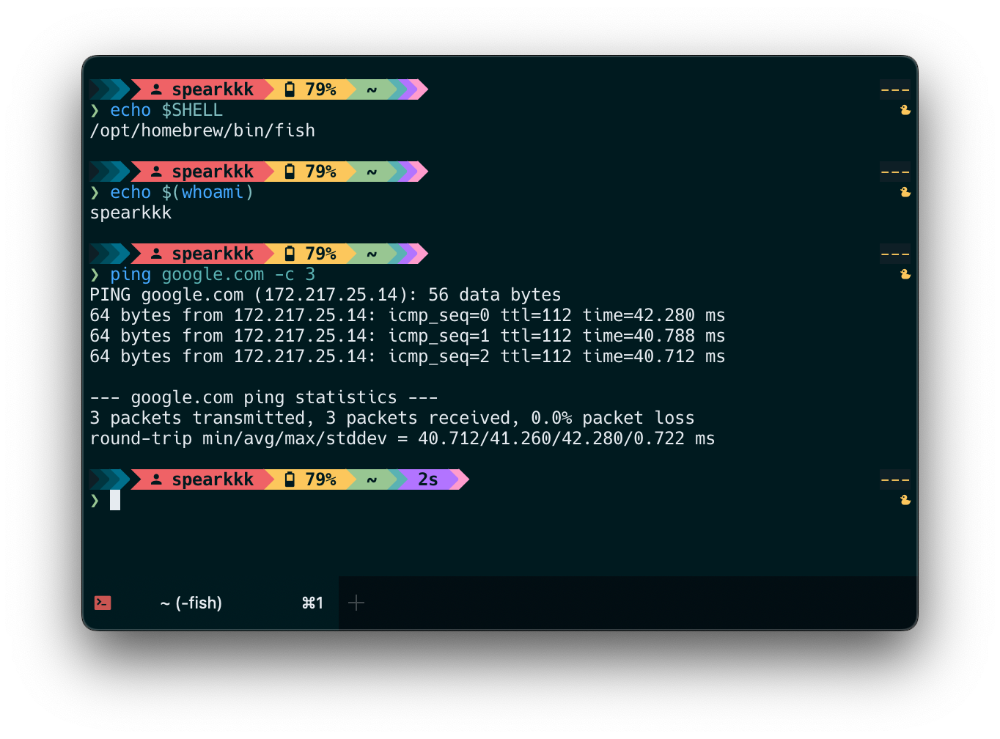
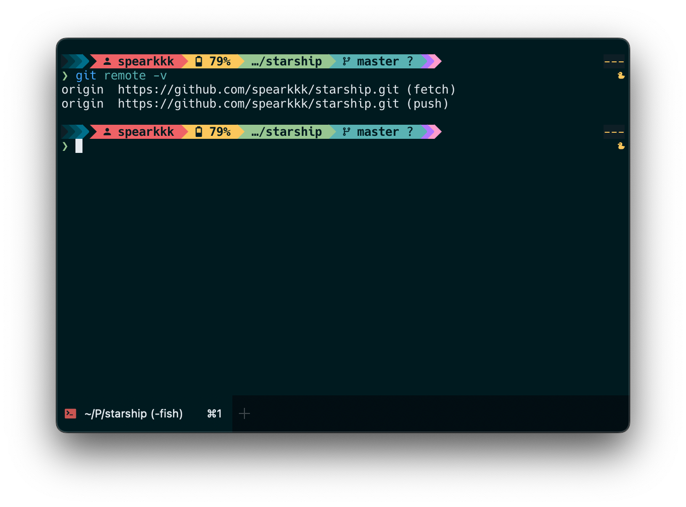

<h3 align="center">
	<br/>
	
	<a href="https://github.com/spearkkk/deep-oceanic-next">Deep Oceanic Next</a> Color Theme for <a href="https://starship.rs">Starship</a>
</h3>
<p align="center">
	<a href="https://github.com/spearkkk/deep-oceanic-next-starship/stargazers"></a>
	<a href="https://github.com/spearkkk/starship-oceanic-next/contributors"></a>
</p>





you can immerse yourself in whatever context you’re working in. Don’t worry about anything else—just like that duck you see over there.  


**How to Get This Nice Theme to My Machine?**
```shell
   mkdir -p ~/.config && curl -o ~/.config/starship.toml \
   https://github.com/spearkkk/deep-oceanic-next-starship/blob/master/starship.toml
```
Please back-up your `starship.toml` file before applying

**Thanks 🫰🏼**

The theme is heavily inspired by the following works:

- [Oceanic Next Color Theme](https://github.com/voronianski/oceanic-next-color-scheme)

**License**

[MIT](LICENSE)


